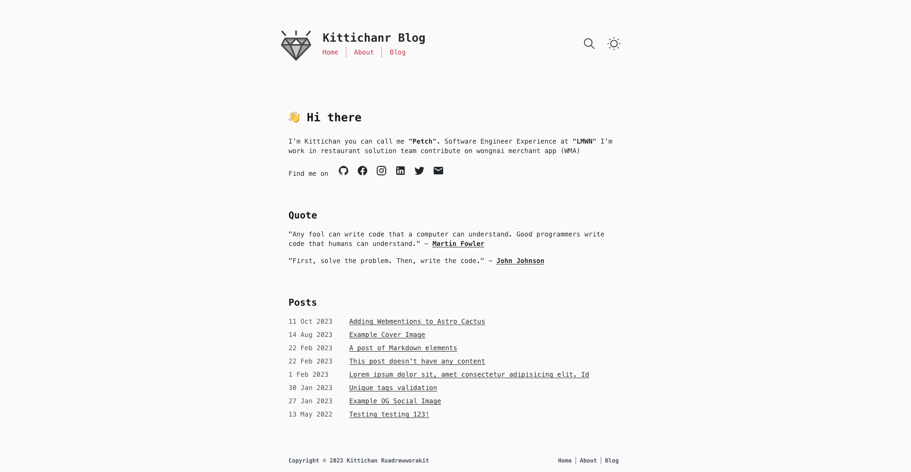
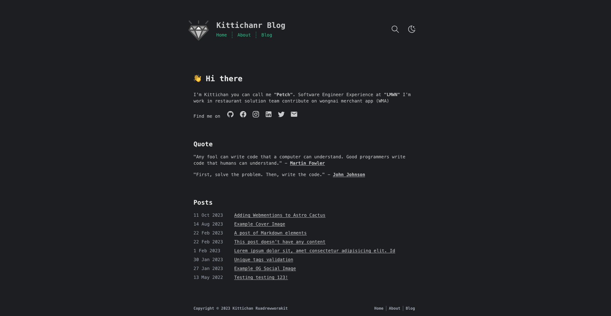

  

<h1 align="center">
  Kiitchanr Blog
</h1>

This is my personal website build by Astro framework. I use cactus theme for initial this project thank you for your inspired. see more configuration in [Repo](https://github.com/chrismwilliams/astro-theme-cactus)

## Preview

## Deploy

I use vercel for deploy my website. this my url <https://kittichanr-blog.vercel.app/>

## License

MIT
